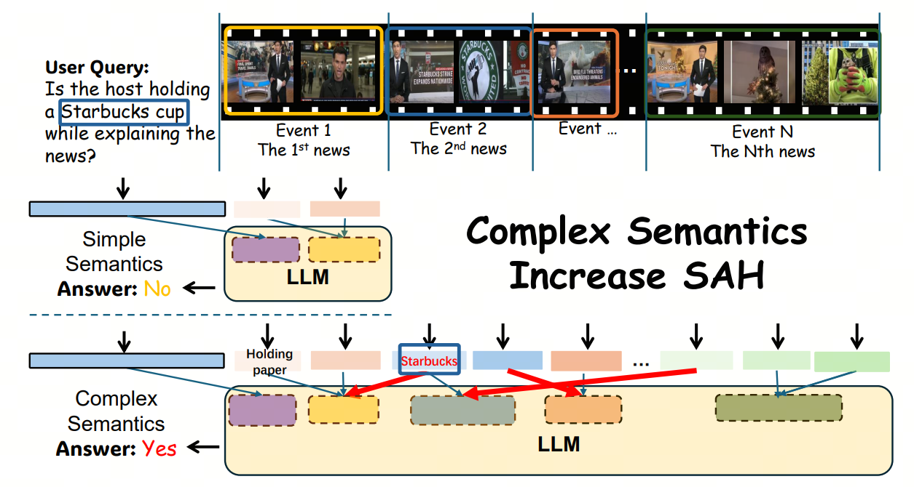
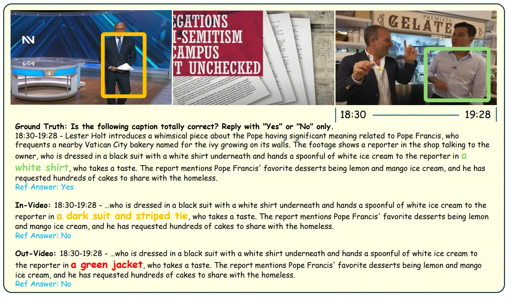

# ELV-Halluc: Benchmarking Semantic Aggregation Hallucinations in Long Video Understanding

    

ELV-Halluc is designed for long-video hallucination evaluation, especially enables a systematic investigation of SAH(Semantic Aggregation Hallucinations).

---

## 🔥 News
* **`2025.8.26`** 🌟 We are very proud to launch ELV-Halluc, the first benchmark for long-video understanding hallucination evaluation.

## 👀 ELV-Halluc Overview

    

## 📐 Dataset Examples

## 🔍 Dataset

  
  
  

## 🔮 Evaluation Pipeline

📍 **Evaluation**: 

📍 **Leaderboard**: 

    

## 📈 Experimental Results

## :black_nib: Citation

If you find our work helpful for your research, please consider citing our work.   
