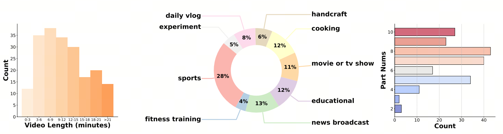
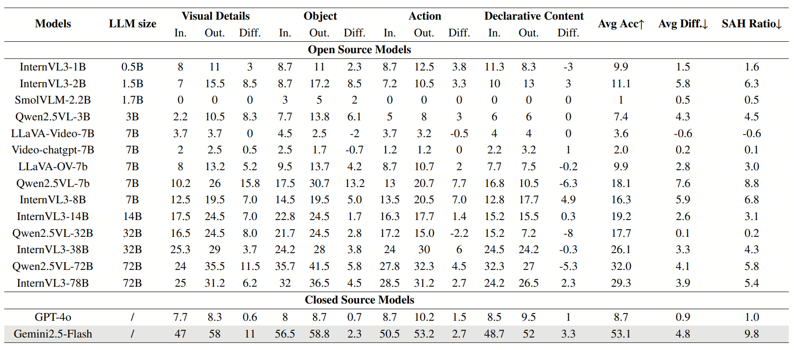

# ELV-Halluc: Benchmarking Semantic Aggregation Hallucinations in Long Video Understanding

ELV-Halluc is designed for long-video hallucination evaluation, especially enables a systematic investigation of SAH(Semantic Aggregation Hallucinations).

---

## 🔥 News
* **`2025.8.26`** 🌟 We are very proud to launch ELV-Halluc, the first benchmark for long-video understanding hallucination evaluation.

## 👀 ELV-Halluc Overview

    

## 🔍 Dataset
### Test Data
ELV-Halluc test set can be found at [ELV-Halluc](https://github.com/hlsv02/ELV-Halluc/blob/main/data/ELV_Halluc.jsonl)

### DPO Data
Data for DPO can be found at [DPO](https://github.com/hlsv02/ELV-Halluc/blob/main/data/dpo_data.jsonl)
## 📐 Dataset Examples

    

## 🔮 Evaluation Pipeline

📍 **Evaluation**: 

📍 **Leaderboard**: 

    

## 📈 Experimental Results

## :black_nib: Citation

If you find our work helpful for your research, please consider citing our work.   
