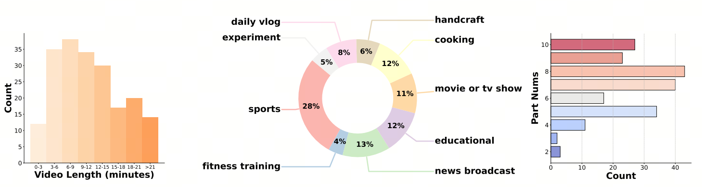
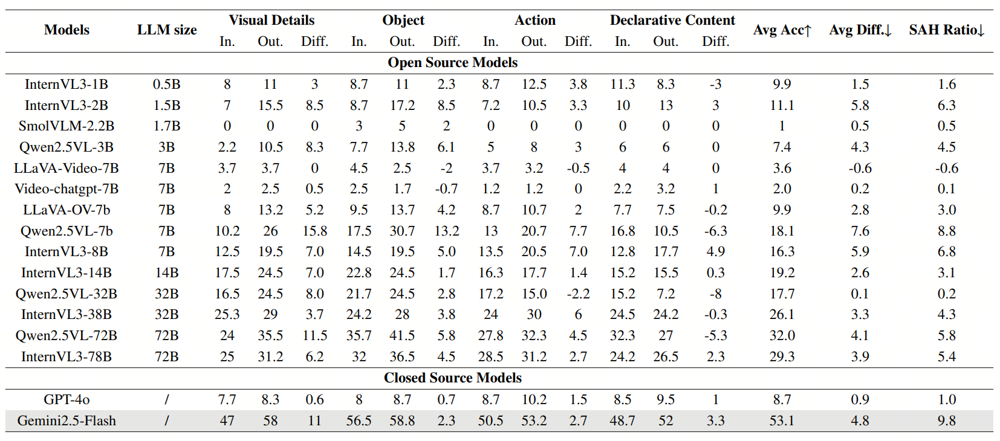

# ELV-Halluc: Benchmarking Semantic Aggregation Hallucinations in Long Video Understanding

ELV-Halluc is designed for long-video hallucination evaluation, especially enables a systematic investigation of SAH(Semantic Aggregation Hallucinations).


[[📖 arXiv Paper](https://arxiv.org/pdf/2508.21496)] [[📊 Dataset](https://huggingface.co/datasets/HLSv/ELV-Halluc)]
---

## 🔥 News\
* **`2025.9.02`** 🌟 We upload our dataset on [Huggingface](https://huggingface.co/datasets/HLSv/ELV-Halluc).
* **`2025.8.26`** 🌟 We are very proud to launch ELV-Halluc, the first benchmark for long-video understanding hallucination evaluation.


## 👀 ELV-Halluc Overview

ELV-Halluc contains **4,800 binary QA pairs**, which can be grouped into **3,200 adversarial QA pairs**.  

- For each selected video, we construct **24 binary QA pairs** by appending the question prefix:  
  *“Is the following caption totally correct? Reply with ‘Yes’ or ‘No’ only.”*  

- These QA pairs cover **four aspects**: visual details, objects, actions, and declarative content.  
  - Each aspect includes 6 questions, formed from 2 triplets within the same video.  
  - Each **triplet** contains three captions: **ground truth**, **in-video hallucination**, and **out-of-video hallucination**.  

- We build **adversarial QA pairs** by combining one ground-truth question with one hallucinated question, yielding two pairs per triplet:  
  - (GT, In-Video Hallucination)  
  - (GT, Out-of-Video Hallucination)  

- A pair is considered **correct** only if the model answers **“Yes”** for the ground-truth question and **“No”** for the hallucinated one.  

Below are the detailed statistics of ELV-Halluc, illustrating its diversity in video length, topics, and number of events.

<p align="center">
    
</p>

## 📐 Data Example

<p align="center">
    
</p>

## 🔍 Dataset
### Test Data
ELV-Halluc test set can be found at [ELV-Halluc](https://github.com/hlsv02/ELV-Halluc/blob/main/data/ELV_Halluc.jsonl).

### DPO Data
The 8k DPO data can be found at [DPO](https://github.com/hlsv02/ELV-Halluc/blob/main/data/dpo_data.jsonl).


## 🔮 Evaluation

Evaluation script is provided at [eval.py](https://github.com/hlsv02/ELV-Halluc/blob/main/eval.py).

Please ensure that your answer files follow the same order as the provided 
[ELV-Halluc dataset](https://github.com/hlsv02/ELV-Halluc/blob/main/data/ELV_Halluc.jsonl).  
You can simply add your model outputs as an extra key `"model_response"` to each entry.

## 🏆 Leaderboard:
<p align="center">
    
</p>

## :black_nib: Citation

If you find our work helpful for your research, please consider citing our work.   

```bibtex
@misc{lu2025elvhallucbenchmarkingsemanticaggregation,
      title={ELV-Halluc: Benchmarking Semantic Aggregation Hallucinations in Long Video Understanding}, 
      author={Hao Lu and Jiahao Wang and Yaolun Zhang and Ruohui Wang and Xuanyu Zheng and Yepeng Tang and Dahua Lin and Lewei Lu},
      year={2025},
      eprint={2508.21496},
      archivePrefix={arXiv},
      primaryClass={cs.CV},
      url={https://arxiv.org/abs/2508.21496}, 
}
```

